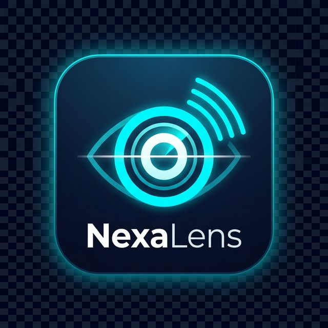

# NexaLens Suite 👁️🌐



**NexaLens Suite** es una potente aplicación de traducción impulsada por Inteligencia Artificial y Realidad Aumentada (AR). Diseñada para romper las barreras del idioma de manera instantánea, permite a los usuarios interactuar con su entorno visual y auditivo de una forma totalmente nueva y fluida.

---

## 🚀 Funcionalidades Principales

### 1. Traductor Visual AR (En vivo)
Apunta con la cámara a cualquier letrero, menú o documento y observa la traducción superpuesta sobre el mundo real. 
- **Modo Freeze**: Pausa el escaneo para leer textos largos con total estabilidad.
- **Detección Inteligente**: Filtrado de texto para enfocarse solo en lo que realmente importa.

### 2. Modo Conversación Bidireccional
Habla con personas de cualquier parte del mundo. 
- **STT & TTS**: Reconocimiento de voz y voz artificial en tiempo real.
- **Interfaz de Chat**: Historial visual de la conversación para no perder ningún detalle.

### 3. Traductor de Fotos (Galería)
Importa capturas de pantalla o fotos de tu galería y extrae el texto mediante OCR avanzado manteniendo el orden de lectura.

### 4. Diccionario y Glosario Inteligente
Guarda términos desconocidos detectados en cualquier módulo en un glosario personal para estudiarlos más tarde.

### 5. Historial Persistente
Registro completo de todas tus traducciones. Gestiona, copia y comparte tus resultados pasados, incluso sin conexión.

---

## 🛠️ Tecnologías Utilizadas

- **Framework**: [Flutter](https://flutter.dev/)
- **IA/ML**: [Google ML Kit](https://developers.google.com/ml-kit) (Text Recognition, Translation, Language ID).
- **Diseño**: Glassmorphism con acentos de neón (Futuristic Dark Theme).
- **Persistencia**: `SharedPreferences` para base de datos local.
- **Multimedia**: `camera`, `speech_to_text`, `flutter_tts`.

---

## 📥 Instalación y Configuración

### Requisitos Previos
- Flutter SDK (^3.11.0 o superior).
- Android SDK (Min API 21).
- Un dispositivo físico con cámara (Recomendado para AR).

### Pasos
1. **Clonar el repositorio**:
   ```bash
   git clone https://github.com/tu-usuario/nexalens-suite.git
   cd nexalens-suite
   ```

2. **Instalar dependencias**:
   ```bash
   flutter pub get
   ```

3. **Generar iconos de la app** (opcional):
   ```bash
   dart run flutter_launcher_icons
   ```

4. **Ejecutar la aplicación**:
   ```bash
   flutter run
   ```

5. **Generar APK de producción**:
   ```bash
   flutter build apk --no-tree-shake-icons
   ```

---

## 🖱️ Instrucciones de Uso

1. **Pantalla Principal**: Selecciona uno de los 5 módulos disponibles.
2. **Uso de la Cámara**: Concede los permisos necesarios. Pulsa el botón ▶️ para iniciar el escaneo continuo y ⏸️ para "congelar" el resultado.
3. **Voz**: Selecciona los idiomas de origen y destino en la parte superior. Mantén pulsado el micrófono mientras hablas.
4. **Guardar**: En cualquier traducción, presiona el icono de marcador (bookmark) para enviarlo a tu Diccionario Inteligente.

---

## 📂 Estructura del Proyecto

- `lib/screens/`: Interfaces de usuario de cada módulo.
- `lib/services/`: Lógica de traducción, historial y diccionarios.
- `lib/theme/`: Definición de la línea gráfica y colores.
- `assets/images/`: Recursos visuales y branding oficial.

---

**Desarrollado con ❤️ para transformar la manera en que el mundo se comunica.**
